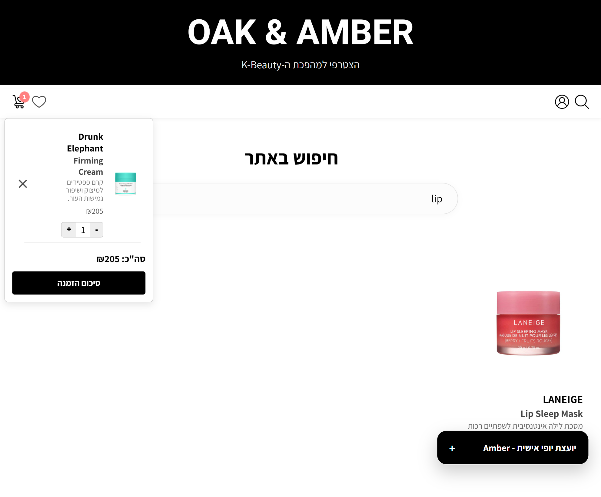
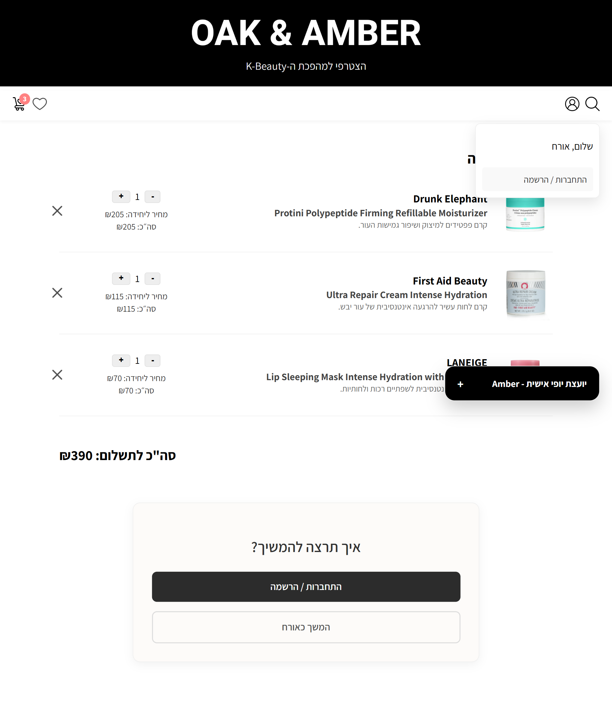
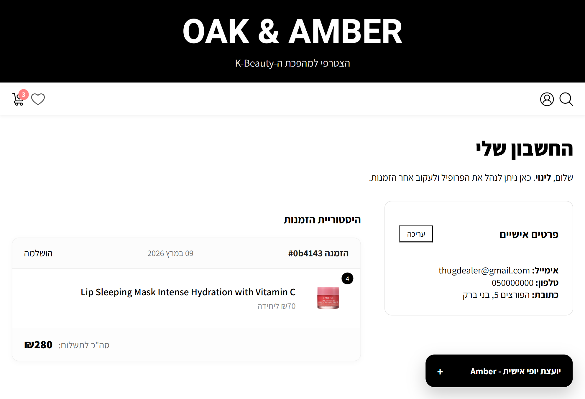

# 🕰️ Oak & Amber (O&A) | Luxury Skincare & AI-Driven E-Commerce

**Oak & Amber** is a high-end Full-Stack E-commerce platform for luxury skincare, featuring a cutting-edge **RAG (Retrieval-Augmented Generation)** AI assistant named **AMBER**. The project showcases a modern architectural approach to combining traditional retail with advanced Semantic Search and Large Language Models.

## 🌐 Live Server
The project is live at http://16.16.184.221/

---

## 🚀 Tech Stack

* **Frontend:** React 19 (Vite), Axios, and React Router 7.
* **Backend:** Python Flask REST API.
* **AI Engine:** Groq API (Llama 3.3 70B) for **RAG** capabilities.
* **Embeddings:** `all-MiniLM-L6-v2` Sentence-Transformers for vectorization.
* **Database:** MongoDB Atlas with **Vector Search** indexes.
* **Deployment:** AWS (Server deployment in progress).

---

## 🌟 Key Technical Highlights

### 🤖 Advanced RAG Implementation
I developed a sophisticated **RAG** (Retrieval-Augmented Generation) system to power the "AMBER" AI consultant:
* **Contextual Intelligence:** The system performs a real-time vector search on the product database to inject relevant ingredients, prices, and reviews into the LLM's prompt.
* **Sales-Driven Guardrails:** Engineered a strict "Operational Protocol" (System Prompt) to ensure AMBER recommends only available products with mandatory ID tags for UI sync.

### 🔍 Semantic Vector Search
Beyond keyword matching, I implemented true semantic search:
* **Mathematical Relevance:** User queries are converted into high-dimensional vectors.
* **Precision Retrieval:** Using MongoDB's `$vectorSearch`, the system identifies products based on user intent (e.g., "soothing cream for sensitive skin").

### 🏗️ Strategic Design Decisions
* **Separation of Concerns:** Backend organized into `Routes`, `Controllers`, `Models`, and a dedicated `RAG` directory.
* **Low-Latency Performance:** Chose **Groq** for LLM inference to ensure instantaneous response times.

---

## 📸 System Previews

| Homepage Interface | AMBER AI Consultant (RAG) | Product Catalog |
| :--- | :--- | :--- |
|  |  |  |

*(Refer to the `/screenshots` directory for full-resolution images)*

---

## 🛠️ Installation & Setup

### Backend (Flask)
1.  Navigate to `/server`.
2.  Install dependencies: `pip install -r requirements.txt`.
3.  Configure your `.env` with `MONGO_URI` and `GROQ_API_KEY`.
4.  Run the server: `python app.py`.

### Frontend (React)
1.  Navigate to `/client`.
2.  Install dependencies: `npm install`.
3.  Start the development server: `npm run dev`.

---
**Developed by Linoy Sahalo - 2026**

